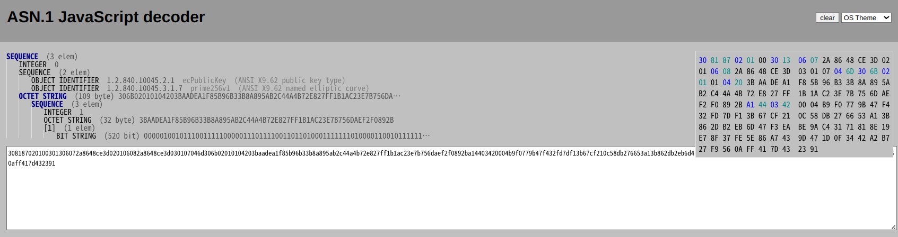

<!-- _class: titlepage -->

# Adventures in the Dungeons of OpenSSL
## Ryo Kajiwara/梶原 龍 (sylph01), 2023/12/15
### @ RubyConf Taiwan 2023

---

<!-- _class: titlepage -->

# Hi!

---

<!--
  _class: titlepage_white
-->

# I do stuff

- Play rhythm games (especially DanceDanceRevolution)
- Play the bassoon/contrabassoon
- Ride a lot of trains (Rails!) (travelled on 99% of JR)
- Build keyboards

if anything catches your interest let's talk!


---

<!-- _class: titlepage -->

# And I do stuff

that is more relevant to this talk:

- Freelance web developer focused on Digital Identity and Security
  - Mainly working at codeTakt, developing ID platforms for schools
- Worked/ing on writing/editing and implementing standards
  - HTTPS in Local Network CG / Web of Things WG @ W3C, OAuth / Messaging Layer Security WG @ IETF
- Worked as an Officer of Internet Society Japan Chapter (2020-23)

---

<!-- _class: titlepage -->

# I'm from the **Forgotten Realm** of Japan called **Shikoku**


<!-- _footer: image https://twitter.com/Mitchan_599/status/994221711942971392 -->

----

# My ticket this time was from **松山(Matsuyama)** to **松山(Songshan)**


----

----

<!-- _class: titlepage -->

# Caution before I start...

----

<!-- _class: titlepage -->

# I'm going to talk about **Dungeons**

----

<!-- _class: titlepage -->

# ... so there be **Dragons**

## Dungeons & Dragons, am I right?

<!--
https://en.wikipedia.org/wiki/Here_be_dragons
-->

----

# Caution

- Cryptographic API can be very easy to misuse
  - What's different from dungeons like `parse.y`-vania is that **you can actually hurt yourself.** Do you like security breaches?
- I've done my research, but I don't consider myself a cryptography expert
  - I don't have a PhD/Master in this field, so yeah...
  - If you're not sure, please have your system audited by a security expert before going to production

----

# Caution

The level of production-readiness in this talk:

- The `hpke` gem: Almost ready
  - Minor changes in the gem API are possible
  - Mostly uses pretty safe stuff
  - But not audited by an external security expert
- OpenSSL extension version of HPKE: **Definitely not**

----

# Past Related Work

- [Do Pure Ruby Dream of Encrypted Binary Protocol? / Yusuke Nakamura @ RubyKaigi 2021](https://youtu.be/hCos6p_S-qc)
  - Implementing QUIC in Ruby
  - Talks about the pain of handling hex-encoded and raw strings in Ruby
  - Also talks about implementing protocols

<!-- By the way, the answer to this question is: "Yes it does. I'm going to talk about one." -->

----

----

<!-- _class: titlepage -->

# HPKE
## Hybrid Public Key Encryption, RFC 9180

----

# What is HPKE

- In the past:
  - Encrypt a session key using Public Key Cryptography
    - like RSA
  - Then send your messages using symmetric ciphers
    - like AES
  - You don't do everything with PKC because it's costly

----

# What is HPKE

- The problem: There is lots of misuse and implementation bugs in cryptography
  - PKCS#1 padding in RSA leading to Bleichenbacher's Oracle Attack
  - Nonce reuse
    - DSA/ECDSA: leading to leakage of private key in PlayStation 3's code signing
    - AES's initialization vector use is everywhere!

<!-- also note that "encrypting with private key gives you Digital Signature" is false -->

----

# What is HPKE

- HPKE solves this by:
  - Using standardized/reviewed protocols to exchange keys and encrypt/decrypt
  - Using best known cipher suites possible
    - combination of cryptographic algorithms
  - **Using high-level APIs that prevent misuse**

----

# What is HPKE

- HPKE uses
  - Agreement of symmetric keys using a **Key Encapsulation Mechanism (KEM)**
    - that internally uses a **Key Derivation Function (KDF)**
  - Then use the symmetric keys to perform **Authenticated Encryption with Associated Data (AEAD)**

----

# So I wanted HPKE in Ruby...

----

# What is needed for HPKE?

- Key Encapsulation Function
  - Diffie-Hellman Key Exchange
    - use of Elliptic Curves: P-256, P-384, P-521, X25519, X448
- Key Derivation Function
  - HMAC-based Extract-and-Expand Key Derivation Function (HKDF)
    - HMAC-SHA256, HMAC-SHA512
- Authenticated Encryption with Associated Data
  - AES-128-GCM, AES-256-GCM, ChaCha20-Poly1305

----

# All of this is supported by **OpenSSL**, right?

----

# Well, **kinda**

----

# What we had readily available

- AES-128-GCM, AES-256-GCM, ChaCha20-Poly1305
  - `test/openssl/test_cipher.rb`
  - ChaCha20-Poly1305 isn't in this test code, but uses the same API as AES-GCM
- HMAC-SHA256, HMAC-SHA512
  - Even with SHA256 and SHA512 only, I can implement HMAC
  - Actually we have HKDF itself but we need to use some parts of HKDF and customize it

----

# What we 'kinda' had

- Elliptic curves P-256, P-384, P-521
  - `test/openssl/test_pkey_ec.rb`
- X25519, X448
  - `test/openssl/test_pkey.rb`

----

# Q: Really? These seem to be undocumented

# A: **Yes.**

----

# Really? These seem to be undocumented

Some APIs in OpenSSL are intentionally left undocumented to avoid misuses by people who are not well-versed in cryptography.

Yes, misuse in cryptography **can hurt yourself.**

<!-- for example: https://github.com/ruby/openssl/commit/e379cc0cca776d0d4be84ddb73bb729f0fdb5ced old documentation has been removed but actual code is not. -->

----

# `OpenSSL::PKey`

Set of classes that handle everything Public Key Cryptography, including RSA, DSA, Diffie-Hellman, and Elliptic Curve Cryptography.

Wraps OpenSSL's `EVP_PKEY` struct.

Note that X25519/X448 is actually ECC but does not use `OpenSSL::PKey::EC`.

----

# Raw public/private key support for X25519/X448

----

# Raw public/private key support for X25519/X448

- There was a pull request that worked on this
- But it was 3 years old and not working on some platforms
- So I started working on this by
  - Fixing errors on the CI matrix
  - Addressing unfixed review comments

----

# https://github.com/ruby/openssl/pull/646

## my first Ruby C extension experience!

----

# While I was at it...

----

# `OpenSSL::PKey` is immutable in OpenSSL 3.0

<!--
  _footer: https://github.com/ruby/openssl/issues/619
-->

----

# So you can't do this

```ruby
pkey = OpenSSL::PKey::EC.new('prime256v1')
pkey.private_key = SecureRandom.random_bytes(32)
```

Note: A private key of `P-256` elliptic curve consists of a 32 byte number (=scalar).

<!-- To be more accurate, it is a positive number under the "order" of the generator, which in `P-256`'s case is `0xffffffff00000000ffffffffffffffffbce6faada7179e84f3b9cac2fc632551`. -->

----

# In OpenSSL 3.0, we were not just missing APIs to make **X25519/X448 key pairs**,

# we didn't even have APIs to make **EC key pairs**!

----

# How can we create a key pair with a **specified** private key?

----

# This was available

```ruby
der = # write something in ASN.1 DER format

OpenSSL::PKey.read(der)
```

----

# ASN.1 Sequence -> DER -> `PKey::EC`

it's even in Ruby 3.3 preview1!

----

# Enter **ASN.1**

- Abstract Syntax Notation One
  - Set of binary notation rules for encoding data structures
- DER (Distinguished Encoding Rules) is the ruleset to describe data structures in exactly one way, so as to ensure digital signatures produce a unique output
- PEM files encode certificates private keys written in DER with Base64

----

# `PKey` -> DER -> ASN.1 Sequence

```ruby
pk = OpenSSL::PKey::EC.generate('prime256v1')
pk.private_to_der.unpack1('H*')
=>
"308187020100301306072a8648ce3d020106082a8648
 ce3d030107046d306b02010104203baadea1f85b96b3
 3b8a895ab2c44a4b72e827ff1b1ac23e7b756daef2f0
 892ba14403420004b9f0779b47f432fd7df13b67cf21
 0c58db276653a13b862db2eb6d47f3eabe9ac4317181
 8e19e78f37fe5e86a7439d471d0f3442a2b727f9560a
 ff417d432391"
```

(formatting just for visibility purposes)

----

# `PKey` -> DER -> ASN.1 Sequence



<!--
  _footer: https://lapo.it/asn1js/
-->

----

# ASN.1 Sequence -> DER -> `PKey::EC`

# **Do it backwards!**

```ruby
  def create_key_pair_from_secret(secret)
    asn1_seq = OpenSSL::ASN1.Sequence([
      OpenSSL::ASN1.Integer(1),
      OpenSSL::ASN1.OctetString(secret),
      OpenSSL::ASN1.ObjectId(curve_name, 0, :EXPLICIT)
    ])

    OpenSSL::PKey.read(asn1_seq.to_der)
  end
```

----

# I did this in the HPKE gem for X25519/X448 too

```ruby
  def create_key_pair_from_secret(secret)
    asn1_seq = OpenSSL::ASN1.Sequence([
      OpenSSL::ASN1.Integer(0),
      OpenSSL::ASN1.Sequence([
        OpenSSL::ASN1.ObjectId(asn1_oid)
      ]),
      OpenSSL::ASN1.OctetString("\x04\x20" + secret)
    ])

    OpenSSL::PKey.read(asn1_seq.to_der)
  end
```

----

# But does this look good?

# **No, it's ugly!**

----

# API to generate PKeys with a private key

[is being worked on @ Issue #555](https://github.com/ruby/openssl/pull/555)

----

# Now we have HPKE in Ruby

## GH: [sylph01/hpke-rb](https://github.com/sylph01/hpke-rb)

## `gem install hpke` now!

<!--
  _footer: note: Still in beta. I will likely tinker around with the API of the gem
-->

----

----

# Well actually, we **had** HPKE itself in OpenSSL 3.2

<!--
  _footer: blog post in OpenSSL Blog: https://www.openssl.org/blog/blog/2023/10/18/ossl-hpke/
-->

----

# Why not write a Ruby wrapper for this?

----

# so **I did.**

## GH: [sylph01/openssl, `hpke` branch](https://github.com/sylph01/openssl/tree/hpke)

## (note: this is super experimental territory, DO NOT use in production!)

----

# How to develop C extensions

[GH: ruby/ruby/doc/extension.rdoc](https://github.com/ruby/ruby/blob/master/doc/extension.rdoc) is your friend.

You want to know how to:

- Convert C values into Ruby values and vice versa
- Wrap a C struct into a Ruby object

<!--
I know this has been talked a lot at RubyKaigis.

Being able to wrap a C struct into an object was a surprising find.
You can keep the C struct as an object state but can also prevent it from being accessed from the Ruby layer.
-->

----

# Handling HPKE Context

```c
OSSL_HPKE_CTX *OSSL_HPKE_CTX_new(int mode, OSSL_HPKE_SUITE suite, int role,
                                 OSSL_LIB_CTX *libctx, const char *propq);
int OSSL_HPKE_encap(OSSL_HPKE_CTX *ctx,
                    unsigned char *enc, size_t *enclen,
                    const unsigned char *pub, size_t publen,
                    const unsigned char *info, size_t infolen);
int OSSL_HPKE_seal(OSSL_HPKE_CTX *ctx,
                   unsigned char *ct, size_t *ctlen,
                   const unsigned char *aad, size_t aadlen,
                   const unsigned char *pt, size_t ptlen);
```

<!--
_footer: https://www.openssl.org/docs/manmaster/man3/OSSL_HPKE_CTX_new.html
-->

<!--
You want to first generate a context, then as a sender, encapsulate the key, seal the message, then send the encapsulation and ciphertext to the receiver
-->

----

# Handling HPKE Context

```c
static void ossl_hpke_ctx_free(void *ptr) {
  OSSL_HPKE_CTX_free(ptr);
}

const rb_data_type_t ossl_hpke_ctx_type = {
  "OpenSSL/HPKE_CTX",
  {
    0, ossl_hpke_ctx_free,
  },
  0, 0, RUBY_TYPED_FREE_IMMEDIATELY
};
```

<!--
  define an rb_data_type_t
  define a function that handles what happens when object is GC'd
-->

----

# Handling HPKE Context

```c
static VALUE hpke_ctx_new0(VALUE arg){
  OSSL_HPKE_CTX *ctx = (OSSL_HPKE_CTX *)arg;
  VALUE obj;

  obj = rb_obj_alloc(cContext);
  RTYPEDDATA_DATA(obj) = ctx;
  return obj;
}

VALUE ossl_hpke_ctx_new(OSSL_HPKE_CTX *ctx){
  VALUE obj;
  int status;

  obj = rb_protect(hpke_ctx_new0, (VALUE)ctx, &status);
  if (status) {
    OSSL_HPKE_CTX_free(ctx);
    rb_jump_tag(status);
  }

  return obj;
}
```

<!--
  This is pretty much taken from OpenSSL::PKey
  This wraps the OSSL_HPKE_CTX into the Ruby object
-->

---

# Handling HPKE Context

```c
static VALUE ossl_hpke_ctx_alloc(VALUE klass) {
  return TypedData_Wrap_Struct(klass, &ossl_hpke_ctx_type, NULL);
}

void Init_ossl_hpke_ctx(void) {
  mHPKE = rb_define_module_under(mOSSL, "HPKE");
  cContext = rb_define_class_under(mHPKE, "Context", rb_cObject);
  ...
  rb_define_alloc_func(cContext, ossl_hpke_ctx_alloc);
}
```

<!--
  Here we are defining the module and the class in the initializer.
  rb_define_alloc_func specifies how to allocate the object using the previously defined rb_data_type_t.
  By default it initializes with a NULL OSSL_HPKE_CTX.
-->

----

# Generating the key

```c
int OSSL_HPKE_keygen(OSSL_HPKE_SUITE suite,
                     unsigned char *pub, size_t *publen, EVP_PKEY **priv,
                     const unsigned char *ikm, size_t ikmlen,
                     OSSL_LIB_CTX *libctx, const char *propq);
```

- `priv` is an `EVP_PKEY` so we can wrap that into `OpenSSL::PKey`
- `pub` is an `unsigned char *` = String, but which format?

----

# Generating the key

Apparently:

- for EC keys it's the equivalent of `priv.public_key.to_octet_string(:uncompressed)`
- for X25519/X448 keys it's the equivalent of `priv.raw_public_key`

<!--
  by the way, OpenSSL::PKey::EC::Point's `to_octet_string` is undocumented in るりま. Only documented in rdoc!
-->

----

# Encapsulating the key

```c
VALUE ossl_hpke_encap(VALUE self, VALUE pub, VALUE info) {
  (snip definitions)

  GetHpkeCtx(self, sctx); // extract C pointer to context from object
  enclen = sizeof(enc);

  if (OSSL_HPKE_encap(
       sctx, enc, &enclen,
       (unsigned char*)RSTRING_PTR(pub), RSTRING_LEN(pub),
       (unsigned char*)RSTRING_PTR(info), RSTRING_LEN(info)) != 1) {
    ossl_raise(eHPKEError, "could not encap");
  }

  enc_obj = rb_str_new((char *)enc, enclen);

  return enc_obj;
}
```

<!--
  Will show only the encapsulation as an example.
  You want to take out `pub` and `info` as an unsigned char, so get the pointer from the Ruby VALUE usign RSTRING_PTR, cast it to unsigned char, then to get the length use the macro RSTRING_LEN.
  Then, you wrap the `enc` string into a new Ruby String VALUE.
-->

----

# How to develop (OpenSSL)

[ruby/openssl's CONTRIBUTING.md](https://github.com/ruby/openssl/blob/master/CONTRIBUTING.md) has a "Testing: With different versions of OpenSSL" section:

- `git checkout openssl-3.2`
- `OPENSSL_DIR=$HOME/.openssl/openssl-something`
- `./Configure --prefix=$OPENSSL_DIR --libdir=lib enable-fips enable-trace '-Wl,-rpath,$(LIBRPATH)' -O0 -g3 -ggdb3 -gdwarf-5`
- `make -j4`, `make install`

----

# How to develop (OpenSSL)

I wanted to peek inside the `OSSL_HPKE_CTX`, but I got an `invalid use of incomplete typedef` error. This is because the full typedef is not exposed to the public header files.

I moved the internal definitions to public header file `<openssl/hpke.h>` then recompiled OpenSSL.

----

# How to develop (OpenSSL gem)

Then to build with that version:

- `bundle exec rake clean`
- `bundle exec rake compile -- --with-openssl-dir=$OPENSSL_DIR`
- `irb -I lib -r openssl`

----

# How to develop (debugging)

I wanted to see the C string in hex printed into the console, so:

```c
void rbdebug_print_hex(const unsigned char *str, size_t len) {
  VALUE rbstr;
  rbstr = rb_str_new((char *)str, len);
  rb_p(rb_funcall(rbstr, rb_intern("unpack1"), 1, rb_str_new_cstr("H*")));
}
```

`rb_p` is your friend. Also `rb_funcall` is nice too.

----

# Example

```ruby
sylph01@grancille:~/projects/openssl-rb$ irb -I lib -r openssl
# keygen
irb(main):001:0> priv = OpenSSL::HPKE.keygen(0x0010, 0x0001, 0x0001)
=> #<OpenSSL::PKey::EC:0x00007f50dfdbb9d8 oid=id-ecPublicKey>
irb(main):002:0> pub = priv.public_key
=> #<OpenSSL::PKey::EC::Point:0x00007f50dfd896e0 @group=#<OpenSSL::PKey::EC::Group:0x00007f50dfd896b8>>
```

----

# Example

```ruby
# sender
irb(main):003:0> sctx = OpenSSL::HPKE::Context.new_sender(0x00, 0x10, 0x01, 0x01)
irb(main):004:0> enc = sctx.encap(pub.to_octet_string(:uncompressed), "Some info")
=> "\x04_\xC2\x19\xA7\x9B\xBB\xE3\xB6\x01\x9Cn\x8DT..."
irb(main):005:0> enc.length
=> 65
irb(main):006:0> ct = sctx.seal("\x01\x02\x03\x04\x05\x06\x07\x08", "a message not in a bottle")
=> "\x82+/\x10\x91\x93\xB8\x00\x80t\x9D>\xD2X\xF6..."
```

---

# Example

```ruby
# receiver
irb(main):007:0> rctx = OpenSSL::HPKE::Context.new_receiver(0x00, 0x10, 0x01, 0x01)
=> #<OpenSSL::HPKE::Context:0x00007f50e4fd9b70>
irb(main):008:0> rctx.decap(enc, priv, "Some info")
=> true
irb(main):009:0> pt = rctx.open("\x01\x02\x03\x04\x05\x06\x07\x08", ct)
=> "a message not in a bottle"
```

----

# Will this go into actual OpenSSL gem?

This still needs a lot of work:

- This is limited to OpenSSL 3.2, so needs guards against older versions
- Hardcoded length values need to be fixed
- Is the C coding actually safe?

----


----

# Conclusion

----

# So here were my **"Adventures in the Forgotten Realm"** called OpenSSL

----

# **Why** HPKE in Ruby?

It's the building block for modern security/privacy protocols

- TLS Encrypted ClientHello
- Oblivious HTTP
- Messaging Layer Security

----

# **Why** HPKE in Ruby?

If we don't have the building block for modern networking protocols, people would not implement them

... and just **go to Python / Go / Rust / whatever** because they have the building blocks readily available.

----

# We need modern cryptography in Ruby **for Ruby to stay relevant**

----

# It's not for everyone
# ... but it **surely is** for someone

----

# The adventure continues...

- HPKE is just a building block for other protocols
- I am working on implementing protocols that rely on HPKE
- Also now that I came back from the OpenSSL dungeon alive, I might continue digging into this "Forgotten Realm"

----

# Shoutouts

(@ mentions are in GitHub ID)

- Ruby OpenSSL maintainers, esp. @rhenium
- Past RubyKaigi speakers, esp. @unasuke and @shioimm
- HPKE implementers, esp. @dajiaji

<!-- and whatever conference team I'm submitting to -->

----

# Questions? / Comments?

## Twitter: @s01 or Fediverse: @s01@ruby.social